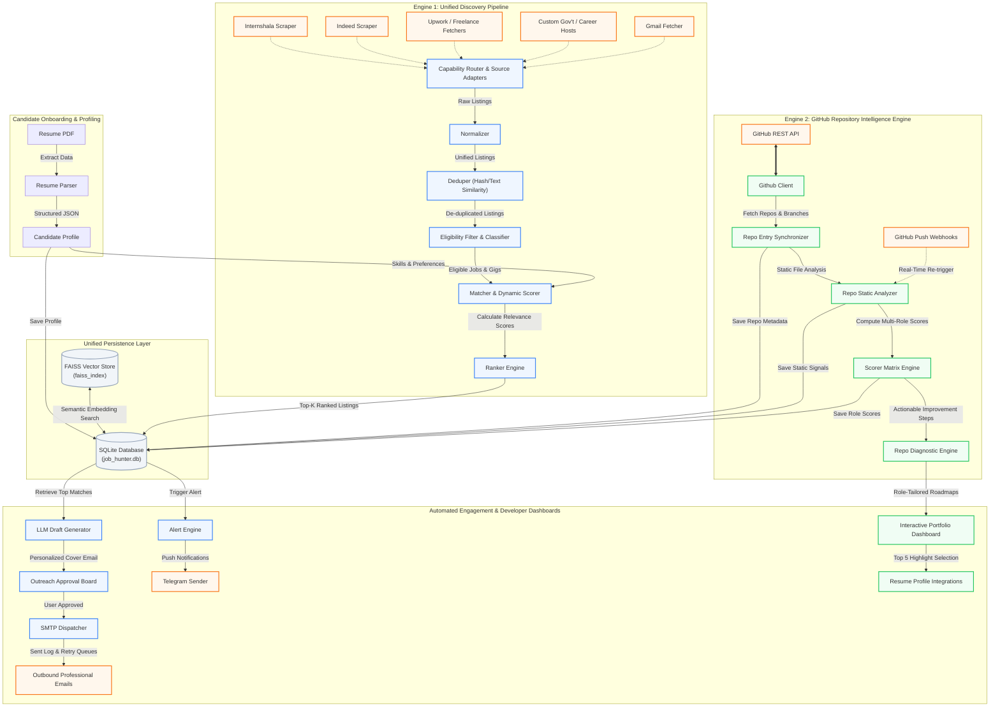
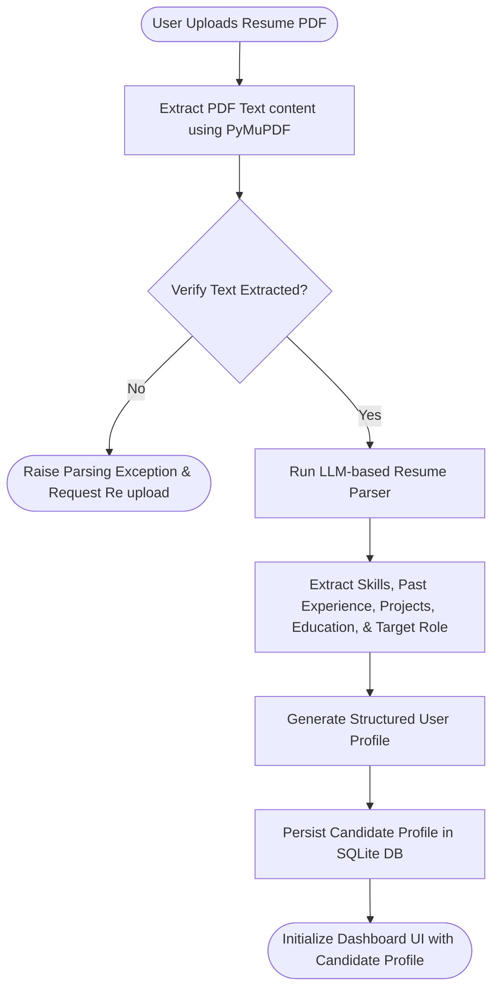
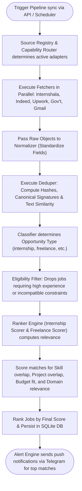
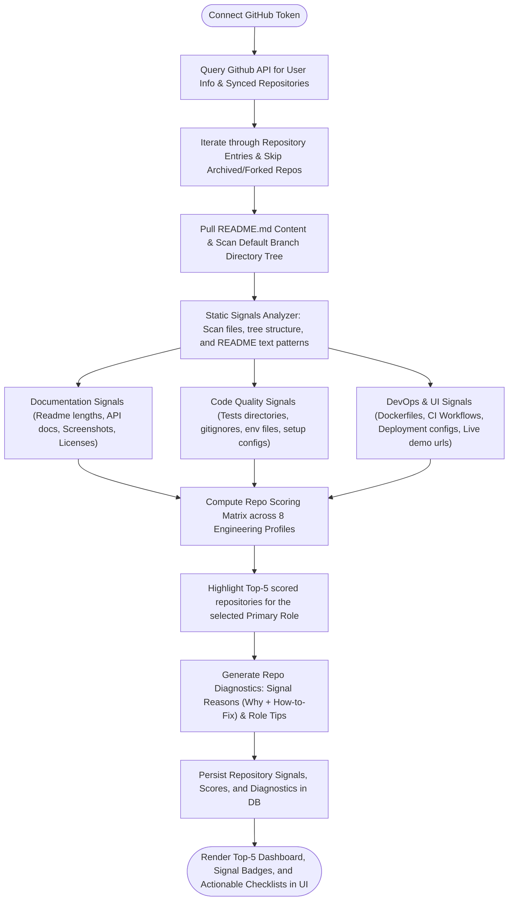

# Job Hunter AI Powered Internship Discovery & Developer Portfolio Intelligence

Job Hunter is a professional grade, full stack application designed to accelerate career growth for software engineers. It functions as a dual engine platform:

1. **Unified Discovery Pipeline & Automated Outreach Engine**: Extracts candidate profiles from resume PDFs. It also features an Alert Engine to send notifications via Telegram and Gmail.

2. **GitHub Repository Intelligence Engine**: Syncs developer portfolios directly from GitHub, performs deep static analysis of repositories (checking structure, README content, test coverage, CI/CD pipelines, containerization, and deployment readiness), scores them against 8 custom engineering profiles (Backend, Frontend, Fullstack, MLOps, DevOps, Agentic AI, Data Science, and Mobile), and generates actionable improvement tips to transform raw side projects into production ready repositories.

## 🌐 Live Demo

You can view the fully interactive static demo of Job Hunter hosted on GitHub Pages:
**[View Live Demo](https://keshavmishra27.github.io/job-hunter/)**

> [!NOTE]
> The demo is a static build running mocked API responses to showcase the frontend UI and the interactive 3D animations without requiring the backend server to be active. To deploy your own demo, navigate to `demo/` and run `npm run deploy`.

---

## System Architecture

The following architectural diagram illustrates the complete flow of data through the dual engine pipeline, highlighting how candidate resumes, scraped job notices, freelance gigs, and synced GitHub portfolios flow into the central database to generate outbound emails, Telegram alerts, and repository improvement cards.



---

## System Workflows

### 1. Resume Parsing & Profile Activation Flow
This sequence parses unstructured PDF resumes into a clean structured schema.



### 2. Unified Discovery Pipeline (Job & Freelance Fetching)
This background execution collects jobs and freelance gigs, categorizes them, normalizes schema, runs deduplication, and scores positions based on user profile.



### 3. Repository Analysis & Developer Portfolio Optimization Flow
This flow performs multi-role portfolio analysis of synced GitHub repositories and yields targeted improvement paths.



---

## Key Features & Capability Highlights

*   **Unified Discovery Pipeline**: A single robust entry point (`pipeline.py`) that orchestrates capability routing, fetching, normalizing, filtering, and ranking.

*   **Intelligent PDF Parser**: High accuracy resume parsing using PyMuPDF extractors combined with LLM prompting structures.

*   **Semantic Matching Matrix**: Employs domain adjacency floors and keyword expansion to compute the exact semantic match between unstructured job specifications and the candidate's skills.

*   **Alert Engine & Telegram Integration**: Instantly notifies users of high priority opportunities or status changes directly via Telegram and Gmail

*   **8 Role Tailored Repository Evaluators**: Deeply scores portfolios based on specific role dimensions (e.g., DevOps weights CI/CD & Docker; Agentic AI weights tool usage).


*   **Actionable Debugger for Portfolios**: Shows detailed explanations and exact correction steps for all missing repository signals.


---

## Technical Directory & Module Mapping

The core logic of Job Hunter is compartmentalized into specific modules, routers, and database schemas:

### Core Modules (`backend/modules/`)
| Module File | Responsibility |
|:---|:---|
| `pipeline.py` | Unified Discovery Pipeline orchestrator unifying fetching, deduping, filtering, and ranking. |
| `capability_router.py` | Routes fetch requests to appropriate source adapters based on capabilities. |
| `source_registry.py` | Manages available adapters and sources (Internshala, Upwork, Gmail, etc). |
| `normalizer.py` | Unifies disparate job boards and freelance data into a single schema. |
| `deduper.py` | Identifies and filters identical or duplicate notices using URL hashes and signatures. |
| `classifier.py` | Classifies raw items into opportunity types (internship, freelance, notice). |
| `eligibility_filter.py` | Applies hard filters based on user experience, duration, and locations. |
| `ranker.py` | Evaluates and scores internship positions based on candidate profile. |
| `freelance_scorer.py` | Evaluates freelance/Upwork gigs using budget, client rating, and tech overlap factors. |
| `resume_parser.py` | Extracts skills, target roles, and work details from uploaded PDF resumes. |
| `alert_engine.py` & `telegram_sender.py` | Dispatches priority push notifications to users via Telegram. |
| `draft_generator.py` | Leverages LLM configurations to write highly contextual cover outreach drafts. |
| `sender.py` | Delivers outgoing emails using SMTP, managing timeouts, retries, and queues. |
| `github_client.py` & `repo_analyzer.py` | Direct integration with GitHub REST API for static analysis scanning. |
| `repo_scorer.py` & `repo_improvements.py` | Computes weighted role scores and generates actionable project feedback. |

### API Routers (`backend/routers/`)
| Router File | Prefix / Tag | Primary Responsibility |
|:---|:---|:---|
| `profile.py` | `/profile` | Handles resume uploading, user metadata profiles, and parsing. |
| `internships.py` | `/internships` | Fetches, ranks, and retrieves software engineering internships. |
| `freelancing.py` | `/freelancing` | Fetches and tracks freelance gigs from platforms like Upwork. |
| `sources.py` | `/sources` | Manages scraping adapters and fetches opportunities from sources. |
| `autopilot.py` | `/autopilot` | Manages the automated queue for sending drafts continuously. |
| `drafts.py` | `/drafts` | Generation, editing, storage, and validation of LLM-generated outreach drafts. |
| `send.py` | `/send` | Triggers dispatch of approved drafts, fetches sent history logs, and retries. |
| `github.py` | `/github` | Connects tokens, syncs repository entries, runs static scoring, and webhooks. |
| `dashboard.py` | `/dashboard` | Aggregates application numbers, activity trackers, and candidate statistics. |
| `applications.py` | `/applications` | Tracks manual and automatic job applications and interview stages. |

### DB Schema Models (`backend/models/`)
| Schema File | Table Name | Key Fields & Associations |
|:---|:---|:---|
| `user.py` | `users` | Candidate details, skills (JSON), target titles, education, parsed profile details. |
| `opportunity.py` | `opportunities`, `freelance_details` | Unified item details (internship or freelance gig): match scores, budget, description, url, location. |
| `draft.py` | `drafts` | Outreach draft text, target job and user foreign keys, approval status (pending/sent). |
| `github.py` | `github_accounts`, `repo_entries`, `repo_analyses`, `repo_scores` | Synced repositories metadata, static analysis signals, role scores, rankings. |
| `sent_email.py` | `sent_emails` | Log of successful/failed outbound deliveries, timestamps, recipients. |
| `application.py` | `applications` | Application tracking records, dates, interview states, corresponding job links. |

---

## Environment Configuration

To configure the application, create a `.env` file in the project's root directory. Follow this template:

```env
# ==========================================
# 1. LLM API CONFIGURATION (Provide at least one)
# ==========================================
OPENAI_API_KEY=sk-proj-...
GROQ_API_KEY=gsk_...
# Optional OpenRouter fallback configuration
OPENROUTER_KEY=or-...

# ==========================================
# 2. EMAIL SERVER CONFIGURATION (SMTP Setup)
# ==========================================
SMTP_HOST=smtp.gmail.com
SMTP_PORT=587
SMTP_USER=candidate.email@gmail.com
# Use Gmail App Password, NOT standard account password
SMTP_PASSWORD=abcd-efgh-ijkl-mnop
MAX_EMAILS_PER_DAY=20

# ==========================================
# 3. TELEGRAM BOT CONFIGURATION
# ==========================================
TELEGRAM_BOT_TOKEN=123456789:ABCdefGHIjkl...
TELEGRAM_CHAT_ID=123456789

# ==========================================
# 4. DATABASE & STORAGE SETTINGS
# ==========================================
# Use async SQLAlchemy protocol for SQLite
DATABASE_URL=sqlite+aiosqlite:///./data/job_hunter.db
WEBSITE_URL=http://localhost:5173
STORAGE_DIR=./storage
FAISS_INDEX_PATH=./data/faiss_index

# ==========================================
# 5. CUSTOM PORTAL CRAWLERS CONFIGURATION
# ==========================================
# Comma-separated list or JSON array of target URLs
GOVT_PORTAL_URLS=["https://example.gov.in/announcements"]
COMPANY_CAREER_HOSTS=["https://company1.com/careers"]
SCHEDULER_INTERVAL_HOURS=6

# ==========================================
# 6. OPTIONAL SCRAPER INTEGRATIONS
# ==========================================
LINKEDIN_EMAIL=candidate@linkedin.com
LINKEDIN_PASSWORD=supersecurepass
```

> [!IMPORTANT]
> **Gmail SMTP App Password**: Google requires the use of a 16-character **App Password** instead of your primary account password. Set up yours under **Google Account Security > 2-Step Verification > App passwords**.

---

## Step by Step Installation & Launch

### Prerequisites
*   **Python**: Version `3.10` or higher
*   **Node.js**: Version `18` or higher, along with `npm`

### Windows (PowerShell) Setup

1.  **Clone and Navigate to Workspace**:
    ```powershell
    cd d:\kfiles\job-hunter
    ```
2.  **Initialize Virtual Environment**:
    ```powershell
    python -m venv .venv
    & .venv\Scripts\Activate.ps1
    ```
3.  **Install Python Dependencies**:
    ```powershell
    python -m pip install --upgrade pip
    python -m pip install -r requirements.txt
    ```
4.  **Install Playwright Scraper Engine (Optional but Recommended)**:
    ```powershell
    playwright install
    ```
5.  **Initialize Frontend dependencies**:
    ```powershell
    cd frontend
    npm install
    cd ..
    ```

---

### Running Locally

You can launch the backend and frontend in separate terminals, or use the pre configured concurrent runner.

#### Method A: Concurrent Runner (Single Command)
Job Hunter is configured to launch both backend and frontend servers simultaneously using the `dev:all` script in the frontend directory:
```bash
cd frontend
npm run dev:all
```
This launches:
- FastAPI backend on [http://localhost:8000](http://localhost:8000)
- Vite frontend dev server on [http://localhost:5173](http://localhost:5173)

#### Method B: Separate Terminals

**Terminal 1 (Backend FastAPI)**:
```powershell
& .venv\Scripts\Activate.ps1
uvicorn backend.main:app --reload --host 127.0.0.1 --port 8000
```
Access backend API documentation at [http://localhost:8000/docs](http://localhost:8000/docs)

**Terminal 2 (Frontend Vite)**:
```bash
cd frontend
npm run dev
```

---

## Testing & QA Suite

Job Hunter features unit and integration tests covering the core parsing, scraping, and scoring engines.

Run all tests from the repository root:
```bash
# Ensure virtualenv is activated
python -m pytest -v
```

To run a specific test suite (e.g. testing the Indeed/other scrapers):
```bash
python -m pytest tests/test_indeed_fetcher.py -q
```

---

## Troubleshooting & Q&A

| Issue / Error | Potential Cause | Definitive Solution |
|:---|:---|:---|
| **`connect ECONNREFUSED 127.0.0.1:8000`** | The FastAPI backend is not active or crashed during startup. | 1. Check your backend terminal for syntax errors.<br>2. Run `uvicorn backend.main:app --port 8000` manually to verify startup.<br>3. Terminate conflicting processes listening on port 8000. |
| **`WinError 10013 / Socket Access Forbidden`** | Another application is occupying port 8000. | 1. Run `netstat -ano \| findstr 8000` in PowerShell.<br>2. Stop the conflicting PID: `taskkill /F /PID <PID_NUMBER>`.<br>3. Or restart FastAPI on a different port: `--port 8080`. |
| **`ModuleNotFoundError`** | Python environment is missing dependencies or the venv is not active. | 1. Ensure `(.venv)` is shown in your terminal prompt.<br>2. Activate it using `& .venv\Scripts\Activate.ps1`.<br>3. Execute `pip install -r requirements.txt` again to update files. |
| **`esbuild Transform Syntax Error`** | Path syntax or format parsing errors inside frontend configs or packages. | 1. Ensure Node.js is updated to 18+.<br>2. Delete `node_modules` and `package-lock.json`, and run `npm install`. |
| **`SMTP Authentication Failed (535)`** | Incorrect SMTP credentials or standard password used instead of App Password. | 1. Enable 2-step verification in your Gmail settings.<br>2. Generate an "App Password" and paste the 16 character string into `SMTP_PASSWORD` in `.env`. |
| **`Scraper logs "Warning: skipping fetch"`** | Scraper host URLs are missing or not properly parsed from `.env`. | 1. Verify `GOVT_PORTAL_URLS` or `COMPANY_CAREER_HOSTS` are configured in `.env`.<br>2. Ensure they are structured as string lists (e.g. valid JSON strings). |

---

## Development Roadmap

### Phase 1 (MVP Completed)
- [x] Resume PDF parsing & profile extraction.
- [x] Profile database management.
- [x] Internshala scraper integrations.
- [x] Normalization & cryptographic deduplication.
- [x] Hard filtering and basic keyword matching algorithm.
- [x] LLM powered outreach cover draft generation.
- [x] Frontend workspace layout with Vite + Tailwind + TypeScript.

### Phase 2 (Completed Operations)
- [x] Connect secure SMTP (Gmail/Custom) dispatcher.
- [x] Implement outgoing email throttling to avoid spam filters.
- [x] Build draft approval and editing workflow dashboards.
- [x] Database sent history logs and retries on failure.
- [x] Syncing public/private repositories with GitHub API.
- [x] Granular static code & README signal analyzers.
- [x] Role-tailored scoring engines with dynamic role weights.
- [x] Actionable feedback panels and missing signal correction guides.

### Phase 3 (Advanced Integration)
- [x] Unified Discovery Pipeline unifying data ingestion.
- [x] Upwork and Freelance Scrapers with custom scoring model.
- [x] Telegram Alert Engine for high-priority notifications.
- [x] Streamlined UI by migrating minibar into main navigation.
- [x] Enhanced resume parser for dynamic preferred roles extraction and reliable database persistence.
- [x] Removed legacy Startup Discovery module to simplify architecture.
- [ ] Deployed multi-container cloud infrastructure (Docker, docker-compose).
- [ ] Playwright-based LinkedIn and Indeed automated scrapers.
- [ ] FAISS Vector store indexing for instant semantic search.
- [ ] Automatic response and interview tracking.
- [ ] Webhook endpoints connected to GitHub triggers for automatic scoring updates.
