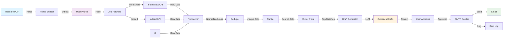
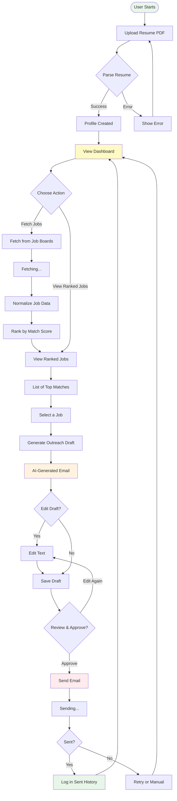

# Job Hunter 

job hunter is a website that helps to best suitable internship based on your resume plus helps you analysing current status of your repo and the further work needed to make repo a production level.

## System Architecture



## Workflow Flowchart



## How to Use Job Hunter

### Step 1: Setup & Installation

#### Backend Setup
```bash
# Navigate to project directory
cd d:\kfiles\job-hunter

# Create virtual environment
python -m venv .venv

# Activate virtual environment
.venv\Scripts\activate

# Install dependencies
pip install -r requirements.txt

# Configure environment variables
create .env
# Edit .env with your API keys:
# - OPENAI_API_KEY or GROQ_API_KEY or OPENROUTER_KEY
# - SMTP_USER (your Gmail)
# - SMTP_PASSWORD (Gmail app password)
```

#### Frontend Setup
```bash
# Navigate to frontend directory
cd frontend

# Install dependencies
npm install

# Start development server
npm run dev
```

#### Start the Application
 **Backend API**: Open terminal and run
 
     `uvicorn backend.main:app --reload --port 8000`
  
    Access Swagger UI: http://localhost:8000/docs

 **Frontend**: Open browser to http://localhost:5173

---

### Step 2: Create Your Profile

1. **Upload Resume**
   
    Click on "Upload Resume" button on the homepage
   
    Select your PDF resume file
   
    The system will parse and extract your information

2. **Review Parsed Profile**
   
    Verify extracted skills, experience, and education
   
    Edit any incorrect information
   
    Save your profile

3. **View Dashboard**
   
    See your profile summary
   
    Access all features from the dashboard

---

### Step 3: Fetch and Rank Jobs

1. **Fetch Jobs**
   
    Click "Fetch New Jobs" button
   
    Select job sources (Internshala, Indeed, LinkedIn)
   
    Specify filters:
     
            Location preferences
            Job type (Internship,   
            Full-time, Part-time)
            Experience level
   
   Click "Start Fetching"

2. **Wait for Processing**
   
    System fetches jobs from multiple sources
   
    Normalizes data to common format
   
    Removes duplicates
   
    Ranks by match score

3. **Review Ranked Jobs**
   
    View top ranked opportunities first
   
    See match percentage for each job
   
    Click on job title to see full details:
         
         Company name
         Job description
         Required skills
         Match score breakdown

---

### Step 4: Generate Outreach Drafts

1. **Select a Job**
   
   Click "Generate Draft" on any job from the ranked list
   
    System analyzes job description and your profile

2. **Review Generated Draft**
   
    AI generates personalized outreach email
   
    Email includes:
     
         Relevant skills match
        Experience highlights
         Personal introduction
        Call to action

3. **Edit Draft (Optional)**
   
    Click "Edit" to modify the email
   
    Add personal touches
   
    Adjust tone or content
   
    Keep changes professional

4. **Approve Draft**
   
   Review final version
   
    Click "Approve & Send" to proceed
   
    Or save as draft to send later

---

### Step 5: Send Emails

1. **Send Immediately**
   
    After approving a draft, system queues the email
   
    Sends via Gmail SMTP (configured in .env)
   
    Tracks send timestamp

2. **Batch Send**
   
    Approve multiple drafts from your queue
   
    System sends with throttling to avoid spam filters
   
    Automatic retry on failure

3. **View Sent Log**
   
   Navigate to "Sent History"
   
    See all emails sent with:
     
       Date/time sent
       Recipient company/email
       Job title
      Email content
   
    Download or resend if needed

---

### Step 6: Track & Follow Up

1. **Dashboard Statistics**
   
    Total jobs fetched
   
    Jobs ranked by score
   
    Drafts generated
   
    Emails sent this week
   
    Response tracking (Phase 3)

2. **Application Tracker**
   
    View all applications made
   
    Track follow-up dates
   
    Log received responses
   
    Mark as interview/rejected

---

## API Endpoints Reference

### Profile Management
| Method | Path | Description |
|--------|------|-------------|
| POST | `/profile/upload-resume` | Upload PDF resume |
| POST | `/profile/parse/{id}` | Extract profile from resume |
| GET | `/profile/{user_id}` | Get user profile |

### Job Management
| Method | Path | Description |
|--------|------|-------------|
| POST | `/jobs/fetch` | Fetch + rank jobs |
| GET | `/jobs/ranked/{user_id}` | Get top ranked jobs |
| GET | `/jobs/{job_id}` | Get single job details |

### Draft Management
| Method | Path | Description |
|--------|------|-------------|
| POST | `/drafts/generate/{user}/{job}` | Generate outreach draft |
| GET | `/drafts/{user_id}` | List all user drafts |
| PATCH | `/drafts/{id}` | Edit draft |
| POST | `/drafts/approve/{id}` | Approve & queue draft |

### Email Operations
| Method | Path | Description |
|--------|------|-------------|
| POST | `/send/` | Send approved draft |
| GET | `/send/log` | View sent email log |
| POST | `/send/retry/{id}` | Retry failed send |

### Dashboard
| Method | Path | Description |
|--------|------|-------------|
| GET | `/dashboard/stats/{user}` | Get user statistics |
| GET | `/dashboard/applications` | Get application history |

## Core Modules

| Module | File | Responsibility |
|--------|------|-----------------|
| **Resume Parser** | `backend/modules/resume_parser.py` | PDF → structured profile extraction |
| **Job Fetchers** | `backend/modules/fetchers/` | Multi source job board scrapers |
| | `fetchers/internshala_fetcher.py` | Internshala internship board scraper |
| | `fetchers/indeed_fetcher.py` | Indeed.co.in job scraper |
| | `fetchers/base_fetcher.py` | Base class for custom fetchers |
| **Normalizer** | `backend/modules/normalizer.py` | Converts raw job data to common schema |
| **Deduper** | `backend/modules/deduper.py` | Hash-based duplicate detection & removal |
| **Ranker** | `backend/modules/ranker.py` | Hard filters + soft scoring algorithm |
| **Vector Store** | `backend/modules/vector_store.py` | FAISS semantic search & similarity matching |
| **Draft Generator** | `backend/modules/draft_generator.py` | LLM powered outreach email generation |
| **Sender** | `backend/modules/sender.py` | SMTP email dispatcher with throttle & retry |

## Environment Configuration

Create a `.env` file in the project root with the following variables:

### Required for Phase 1
```env
# LLM API => Choose one or provide all for fallback:
OPENAI_API_KEY=your_openai_key
GROQ_API_KEY=your_groq_key
OPENROUTER_KEY=your_openrouter_key

# Email Sending (Gmail)
SMTP_USER=your_email@gmail.com
SMTP_PASSWORD=your_gmail_app_password

# Database
DATABASE_URL=sqlite:///./job_hunter.db
```

### Recommended for Phase 3
```env
# FAISS Vector Search
VECTOR_STORE_PATH=./data/vector_store.faiss

# Job Board APIs (optional for now)
INTERNSHALA_API_KEY=
INDEED_API_KEY=
LINKEDIN_USER=
LINKEDIN_PASSWORD=
```

**Note:** For Gmail SMTP, create an [app specific password](https://support.google.com/accounts/answer/185833), not your regular Gmail password.

---

## Development Roadmap

### Phase 1 (MVP - Current)
Resume PDF parsing & profile extraction

 Profile management API

 Internshala job fetcher

 Job normalization & deduplication

 Ranking algorithm with filters & scoring

  LLM powered draft generation
 Draft editing & management

 Frontend: Resume upload, profile view, job listing, draft generation

### Phase 2 (Outreach)
  Draft approval workflow with UI

 Email sending via Gmail SMTP

 Email throttling (avoid spam filters)

  Retry logic for failed sends

  Sent email logging

 Frontend: Draft approval, send queue, sent history

### Phase 3 (Advanced Matching)

  Indeed.co.in job fetcher

LinkedIn scraper (Playwright-based)

  FAISS vector search for semantic matching

  Follow up email automation

  Application response tracking

 Frontend: Advanced filtering, follow-up scheduler, response tracker

---

## Troubleshooting

### Issue: "ModuleNotFoundError" when running backend
**Solution**: Ensure virtual environment is activated
```bash
.venv\Scripts\activate
```

### Issue: "Email not sending"
**Solution**: 

 Check Gmail app password is correct (not regular password)

 Ensure "Less secure app access" is enabled (if not using app password)

 Check SMTP credentials in `.env`

### Issue: "API returns 500 error"
**Solution**:

 Check backend terminal for error logs

 Verify database path is accessible
 
 Ensure all required environment variables are set

### Issue: "Jobs not fetching from Internshala"
**Solution**:
 
 Verify internet connection

 Check if Internshala website is accessible

 Review job board's terms of service for scraping


